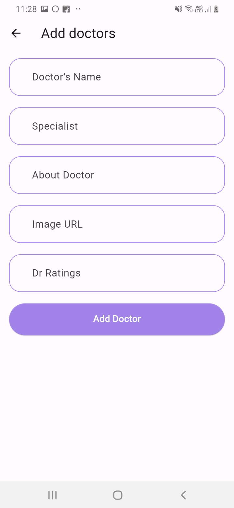

# Book Your Doctor

This Flutter Application allows users to book appointments with their preferred doctors.

## Features

- User Authentication: Users can sign in and sign up to access the app.
- Doctor Listings: Users can view a list of doctors available for booking.
- Appointment Booking: Users can book appointments with their preferred doctors.
- Notifications: Users receive notifications for appointment reminders.
- Profile Management: Users can manage their profiles and appointment history.

## Sign-in Page

  

## Home Page

  

## Add Doctor

## Flow

- User opens the app and is presented with a login screen.
- If the user is new, they can choose to sign up instead.
- After successful authentication, the user is directed to the home screen.
- The home screen displays a list of available doctors.
- Users can search for specific doctors or filter by specialization.
- Tapping on a doctor opens their profile with details like name, specialization, and availability.
- From the doctor's profile, users can view available time slots and select one for booking.
- Users can also view their appointment history and cancel appointments if needed.
- Users can log out of the app, which will require them to log in again to access their account.

